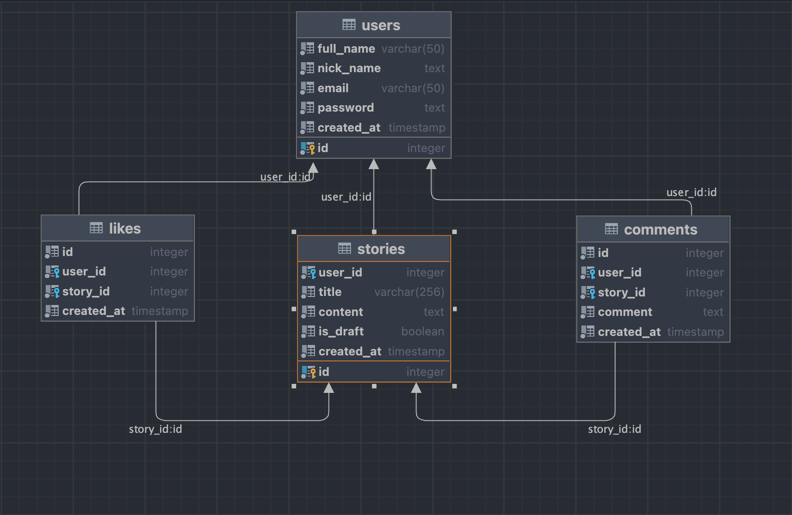

# Story App
## _Playing with Kotlin on the server side_

A small rest api to learn a little bit of Kotlin with the following features 

- Project created with Ktor framework
- database in PostgreSQL
- Integration JWT for Authentication

## Dependencies

- [Status pages](https://ktor.io/docs/status-pages.html) - allows to respond appropriately to any failure state based on a thrown exception.
- [Content negotiation and serialization](https://ktor.io/docs/serialization.html) - Negotiating media types between the client and server
- [Logback](https://github.com/qos-ch/logback) - Handle logs.
- [Authentication and authorization](https://ktor.io/docs/authentication.html) - plugin to handle authentication and authorization
- [Exposed](https://github.com/JetBrains/Exposed) - SQL library
- [PostgreSQL JDBC Driver](https://jdbc.postgresql.org/) - PostgreSQL JDBC Driver Postgresql
- [HikariCP](https://github.com/brettwooldridge/HikariCP) - JDBC connection pool

## Database diagram



## Prerequisites

- Java JDK11
- IntelliJ IDEA Ultimate [IntelliJ IDEA](https://www.jetbrains.com/help/idea/installation-guide.html)
- PostgreSQL
- Before to run the app, please create the database from the PostgreSql console.
```sh
CREATE DATABASE storyapp;
```
- and please update the user on the file DatabaseFactory.kt on the line
```sh
config.jdbcUrl = "jdbc:postgresql:storyapp?user=postgresUser"
```


## Run a Ktor app
open the Application.kt file placed by the following path:

```sh
src/main/kotlin/co/wawand/Application.kt
```

To run the application, click the gutter icon next to the main function and choose Run 'ApplicationKt'.

the server should be running to accept requests at the http://127.0.0.1:8080

## Start to send requests to the server
The endpoints available to send requests

### Authentication routes

>Register User (POST)
```sh
http://127.0.0.1:8080/auth/register
```
Body request
```sh
{
  "fullName":"John Doe",
  "email": "jdoe@fake.co",
  "password": "123456",
  "nickName": "jdoe"
}
```

Body response
```sh
{
  "data": {
    "id": 11,
    "fullName": "John Doe",
    "nickName": "jdoe",
    "email": "jdoe@fake.co",
    "authToken": "stringToken",
    "createdAt": "2023-04-11T15:42:19.158813"
  },
  "message": "User successfully registered"
}
```
>Login (POST)
```sh
http://127.0.0.1:8080/auth/login
```
Body request
```sh
{
  "email": "jdoe@fake.co",
  "password": "123456"
}
```

Body response
```sh
{
  "data": {
    "id": 11,
    "fullName": "John Doe",
    "nickName": "jdoe",
    "email": "jdoe@fake.co",
    "authToken": "stringToken",
    "createdAt": "2023-04-11T15:42:19.158813"
  },
  "message": "User successfully logged in"
}
```

### More routes

>User Info (GET)
```sh
http://127.0.0.1:8080/user
```
Add to the headers the Authorization key
```sh
{
  "fullName":"John Doe",
  "email": "jdoe@fake.co",
  "password": "123456",
  "nickName": "jdoe"
}
```